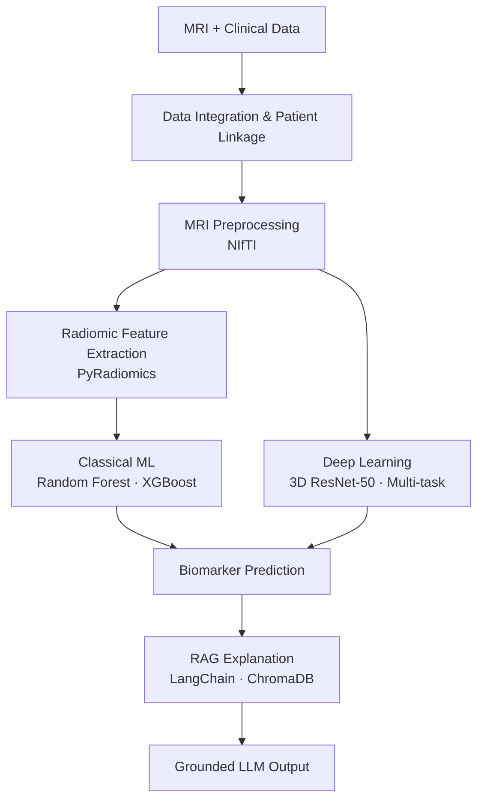

# Vishnu P

Hi 👋, I'm Vishnu P

An M.Sc. Software Systems student building practical AI applications with machine learning, data pipelines, APIs, and LLMs, focusing on research-oriented, production-minded AI systems.

## 🛠️ Tech Stack

### Languages, Data & ML

 
 
 
 
 

### Tools & Platforms  

## 📄 About

I work across the AI development lifecycle: data preprocessing and feature engineering, model development and evaluation, API integration, documentation, and deployment support. I am particularly interested in research-oriented, production-minded AI systems, with a focus on healthcare and medical AI.

## 🚀 Featured Project: RadiGenRAG-Oncology

A research-grade, non-clinical prototype for predicting glioma molecular biomarkers from multiparametric MRI, with explainable, retrieval-grounded research support.

**Target biomarkers:** IDH mutation · MGMT methylation · 1p/19q co-deletion

<b>Technical details</b>

 

- **Imaging:** PyRadiomics, NiBabel, SimpleITK
- **Modeling:** scikit-learn, XGBoost, PyTorch (3D ResNet-50)
- **Explanation layer:** LangChain, ChromaDB, LLM integration
- **Data integrity:** patient-level dataset linkage and strict patient-level train/test splitting to reduce the risk of data leakage
- **Datasets referenced:** UCSF-PDGM, TCGA-LGG, TCGA-GBM, UCI mutation datasets
- **Evaluation metrics:** Accuracy, AUROC, F1 score

> **Disclaimer:** RadiGenRAG-Oncology is a research-grade, non-clinical prototype. It is not intended for medical diagnosis or clinical treatment recommendations.

## 📈 Contribution Activity

## 🎓 Education

**M.Sc. Software Systems** — *K G College of Arts and Science, Coimbatore* (CGPA: 7.19)  
**Higher Secondary Education** — *T.K.S Matric. Hr. Sec. School, Coimbatore* (75%)

## 🏆 Certifications & Training

| 🏆 Certification | 📚 Description |
| :--- | :--- |
| **Diploma in Computer Applications (DCA)** | MS Office, C Programming, Object-Oriented Programming with Python |
| **Frontend Web Development Internship** | HTML, CSS, responsive design principles |

## 📫 Let's Connect

<table>
<tr>
<td align="center" width="33%">

 
p9744065@gmail.com
</td>
<td align="center" width="33%">

 
Vishnu4063
</td>
<td align="center" width="33%">

 
Location
</td>
</tr>
</table>

## 💡 *"Turning ideas into intelligent software; Build. Learn. Experiment. Innovate!"*

 
⭐️ From [Vishnu4063](https://github.com/Vishnu4063) with 💙

</content>